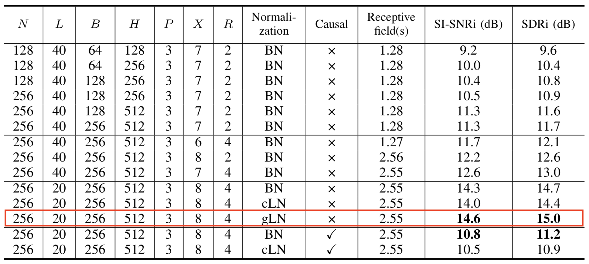

# Conv-TasNet

Implementation of ''TasNet: Surpassing Ideal Time-Frequency Masking for Speech
Separation''.

The default setting I used:



## Dependencies

* python3.6.6

You can check and install other dependencies in `requirements.txt`.

```
$ pip install -r requirements.txt
# to install TensorFlow, you can refer to https://www.tensorflow.org/install/
```

### Data

Put your training, validation, and testing data under `data/train`, `data/valid`,
and `data/infer` respectively.
The program will parse all `data/{train, valid, infer}/*.wav` non-recursively
and please note that the default sample rate is `8000`.

### Usage

#### Training

```
$ python main.py --mode train
```

#### Inference

```
$ python main.py --mode test
```

#### Other Arguments

If you would like some different settings for this model, you can refer to
`utils.py`.
